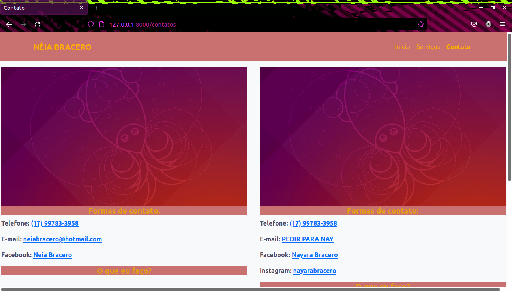

# Saloon Website
> A amateur site wich contains (Home, Services, Contact) navigations bars

The purpose of the site is to create a domain for the person who is disclosing the information, facilitating access to the information for its customers.



## Instalation 

First of all, you wanna have Python 3.x installed on your computer. Visit https://www.python.org/ and download it.

And so, you'll need to install an IDE (Integrated Development Environment). During the developing of this website, I used the Visual Studio Code, from Microsoft.

After done, copy and paste the codes bellow on you cmd or terminal.

```sh
pip install asgiref beautifulsoup4 Django django-bootstrap4 django-stdimage Pillow soupsieve sqlparse
```

## Instalation pt 2 - GIT 

Open you **Browser and VSCode.**

Then **in your browser** go on project, click on the green button, copy the link.

**In your VSCode**, click on file on you top left side, then "Open Folder", choose the folder you'll want to keep this project and open it.

Still in your VSCode, open the terminal pressing Ctrl + Shift + ´ and paste this:

```sh
git clone https://github.com/BraceroInSabot/Saloon_site.git
```

## How to use it

Open the terminal and write: 

```sh
python3 manage.py runserver 
```

And done, you are now on a localhost server viewing the website

## Patch Notes

* 0.0.1
    * Pilot version of project launched
    * READme file added


## Meta

Guilherme Bracero Gonzales - [@bracerin](https://twitter.com/bracerin) - guibragon@gmail.com

### PT-BR
Licenças e direitos sobre o código:
1. É um código free code. Pegar do meu código para colar no seu é permitido.
2. Em hipostése alguma é permitida a venda de projetos com MUITA semelheança à esse.
3. As pessoas que compartilharam dos seus dados para a criação da página, não permitem que estranhos os usem.
4. Foi pedida a permissão para a publicação de todo o dado compartilhado no projeto.

### EN-US
Licence and rights about the code:
1. It's a free code. Taking from my code to paste into yours is allowed.
2. Under no circumstances is it allowed to sell projects with MUCH similarity to this one.
3. The people who shared their data for the creation of the page, do not allow strangers to use it. Ask for permission first.
4. Permission was requested to publish all shared data in the project.